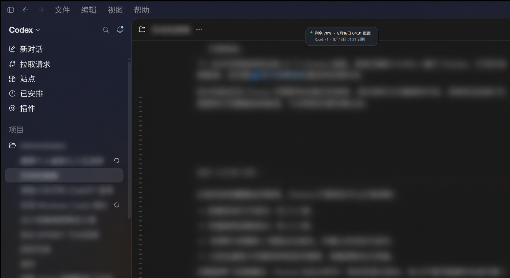

# Codex 额度悬浮层（Windows）

[English](README.md) · [下载安装包](https://github.com/cpys/codex-quota-overlay/releases/latest) · [隐私说明](PRIVACY.zh-CN.md)

Codex 额度悬浮层是一个轻量的 Windows Codex 桌面伴侣。它会在当前会话标题旁显示剩余额度、下次重置时间和可用重置卡；只要 Codex 不再位于前台，就会立即隐藏。



截图保留了真实的 Codex 窗口和悬浮层位置；与演示无关的工作区、会话和账户内容已为保护隐私而模糊处理。

> [!IMPORTANT]
> 这是独立的社区开源项目，与 OpenAI 没有隶属、授权或支持关系。

## 功能

- 在同一行显示 Codex 剩余额度百分比和下次重置时间。
- 服务返回重置卡时，显示可用数量以及每张卡的到期时间。
- 只有 Codex 桌面窗口位于前台时才显示。
- 不抢焦点，鼠标可以直接穿透悬浮层操作 Codex。
- 适配逐显示器 DPI、最小化、多显示器和单实例运行。
- 托盘菜单支持立即刷新、开机启动、检查更新、隐私说明、版本信息和退出。
- 通过 Codex 官方文档公开的本地 App Server JSON-RPC 接口读取；不截图、不读取浏览器 Cookie，也不会消耗重置卡。
- 可选、先征得同意的每日一次匿名使用心跳，详见[隐私说明](PRIVACY.zh-CN.md)。

## 系统要求

- Windows 10 或 Windows 11。
- 已安装 Codex 桌面应用，并使用 ChatGPT 托管账户登录。
- .NET Framework 4.8（当前受支持的 Windows 通常已自带，也可从微软安装）。

仅使用 API Key 或非 ChatGPT 账户的 Codex 配置，可能没有可读取的 ChatGPT 额度信息。

## 安装

1. 打开 [GitHub 最新版本](https://github.com/cpys/codex-quota-overlay/releases/latest)。
2. 下载 `CodexQuotaOverlay-Setup-<版本号>.exe`。
3. 运行安装器，可按需勾选开机启动或桌面快捷方式。
4. 启动后，Windows 通知区域会保留一个 `%` 图标。

目前安装包没有商业代码签名证书，Windows SmartScreen 可能首次提示。请始终将安装包的 SHA-256 与同一版本中的 `SHA256SUMS.txt` 对照。取得合适证书后会加入代码签名。

每个版本也提供便携 ZIP。若要开启开机启动，请先把它解压到固定目录。

## 使用

让程序保留在通知区域即可。当 Codex 位于前台时，额度悬浮层会自动放到会话标题旁；切换到其他应用、最小化或退出 Codex 后，它会立即隐藏。

右键托盘图标可以：

- 立即刷新额度；
- 开启或关闭开机启动；
- 在已配置统计服务的版本中管理匿名使用统计；
- 打开隐私说明、版本下载页；
- 查看当前版本或退出。

只包含运行错误摘要的日志位于：

```text
%LOCALAPPDATA%\CodexQuotaOverlay\overlay.log
```

日志不会记录账户令牌或完整的 App Server 响应。

## 从源码构建

本地构建没有第三方依赖，直接使用 Windows 自带的 .NET Framework 编译器：

```powershell
.\build.ps1
```

可执行文件输出到 `artifacts\bin`。使用 Visual Studio 2022 时也可以打开 `CodexQuotaOverlay.sln` 构建 `net48` 项目。

制作安装包需要先安装 [Inno Setup 6](https://jrsoftware.org/isinfo.php)，然后运行：

```powershell
.\package.ps1
```

运行源码与解析冒烟测试：

```powershell
.\test.ps1
```

## 版本和发布

项目遵循语义化版本。`VERSION`、程序集信息、安装器、Git 标签和 GitHub Release 必须保持一致。推送 `v0.1.0` 这样的标签后，发布工作流会生成安装包、便携 ZIP 和 SHA-256 校验文件。

## 兼容性说明

额度来自官方文档中的 [`account/rateLimits/read`](https://learn.chatgpt.com/docs/app-server#6-rate-limits-chatgpt) 方法。Codex 更新较快，因此每个版本都会针对当时的桌面版本验证，并对缺失的可选字段做兼容处理。报告兼容问题时，请同时提供 Codex 和悬浮层的版本号。

## 参与贡献

欢迎提交问题和合并请求。请先阅读 [CONTRIBUTING.md](CONTRIBUTING.md)、[SECURITY.md](SECURITY.md) 和 [CHANGELOG.md](CHANGELOG.md)。

## 开源许可

[MIT](LICENSE)
