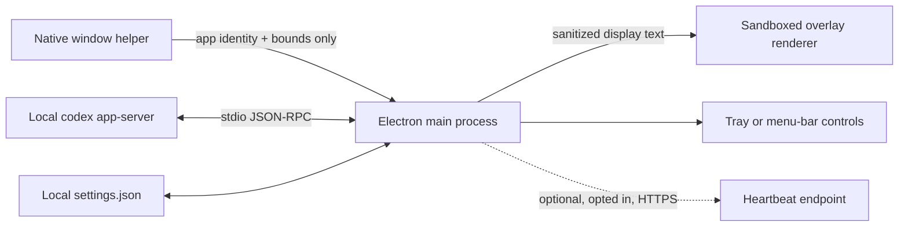

# Architecture

Codex Quota Overlay is a local-first Electron application with small native foreground-window helpers for Windows and macOS. The renderer is a single transparent, click-through window; there is no embedded web service or remote control plane.

## Runtime flow

1. Electron's per-user single-instance lock prevents duplicate overlays.
2. A native helper identifies the frontmost application and returns its identity and window bounds. It deliberately leaves the title empty.
3. When an official Codex Desktop window is active, the main process launches the locally installed `codex app-server` over stdio.
4. After JSON-RPC initialization, it calls only `account/rateLimits/read` and accepts rate-limit update notifications.
5. The response is reduced to display-only quota, reset time, and available reset-credit fields.
6. A non-activating, topmost, click-through overlay is positioned beside the Codex conversation title. It hides when Codex is inactive, minimized, or closed.

## Process and trust boundaries

The Electron main process owns all filesystem, process, window, startup, and network capabilities. The overlay renderer receives only text, accent color, and locale through a narrow preload bridge.

Renderer protections include:

- Chromium sandboxing and context isolation;
- Node integration disabled;
- a `default-src 'none'` Content Security Policy;
- denied navigation and new-window creation;
- sender and frame-URL validation for measured-size IPC; and
- no remote content.

Production packages use ASAR, embedded ASAR integrity validation, app-only-ASAR loading, disabled `ELECTRON_RUN_AS_NODE`, and disabled Node options/inspector flags. The local renderer uses Electron's `file:` handling only for files inside the integrity-checked application archive; its Content Security Policy blocks network access.

## Native helpers

- **Windows:** a small C# helper reads the foreground window, owning process identity, visibility/cloaking state, and bounds using Win32 APIs.
- **macOS:** a Swift helper reads the frontmost application identity and Accessibility window bounds. CI compiles and validates both x64 and arm64 slices.

Neither helper reads conversation titles, screen pixels, clipboard data, browser cookies, or Codex storage.

## Local state

`settings.json` may contain placement offsets, a manually selected CLI path, telemetry consent, a random installation UUID, and the last heartbeat time. Operational errors remain in process memory and can be copied only as a sanitized diagnostic capped at 200 characters. The current application writes no operational log.

## Telemetry boundary

Public source and release builds have no telemetry endpoint configured and send no heartbeat. If a future reviewed build supplies an HTTPS endpoint, the client still requires explicit user opt-in, sends at most one privacy-documented event per 24 hours, and backs off after failure. Quota data and Codex/account fields never cross this boundary. See [PRIVACY.md](../PRIVACY.md).

## Build and release

GitHub Actions runs the same lint, format, type, coverage, unit, host-simulation, and Electron smoke gates on pull requests. Platform jobs compile native helpers, create packages, run packaged-app self-tests, and publish only from an immutable matching version tag. Releases include platform checksums, a CycloneDX SBOM, and GitHub artifact attestations. See [RELEASING.md](RELEASING.md).
